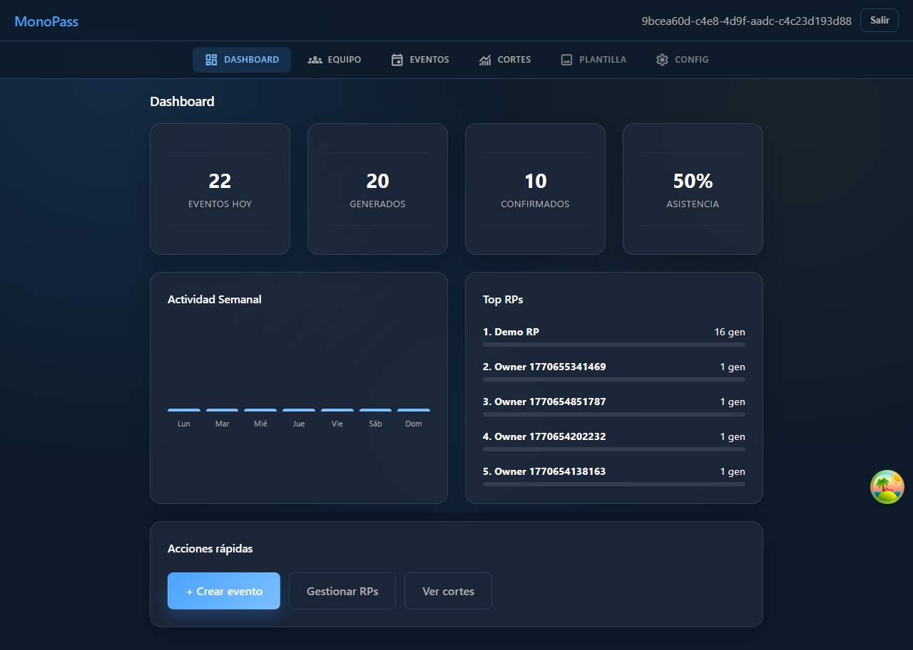
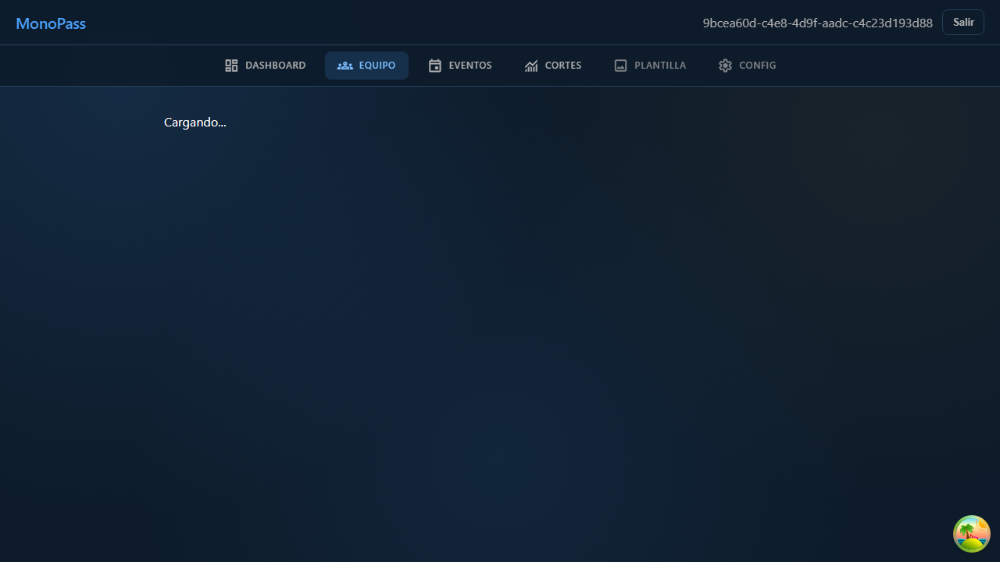
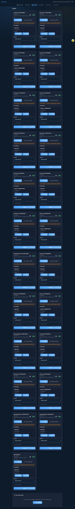
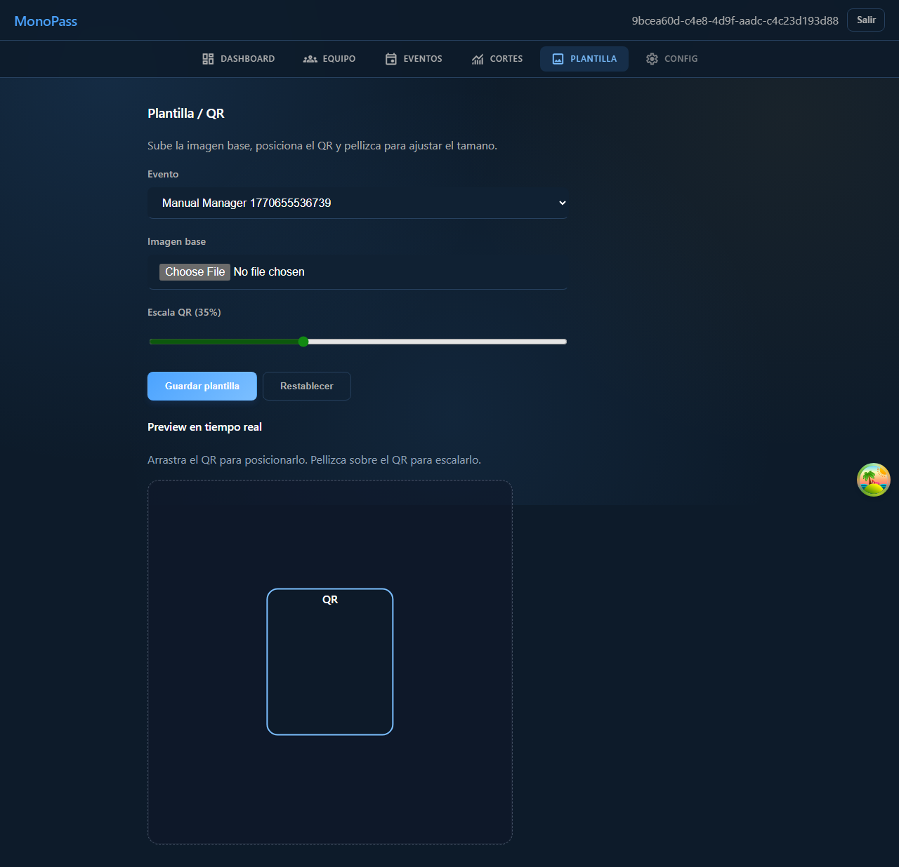
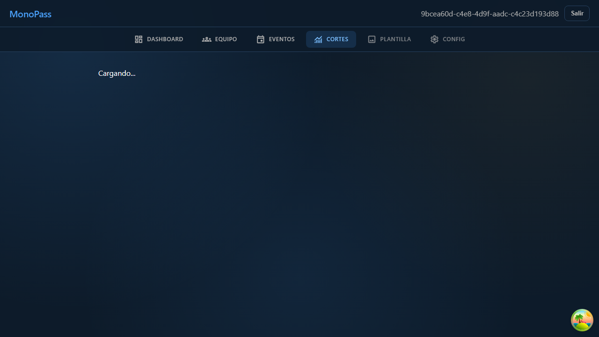
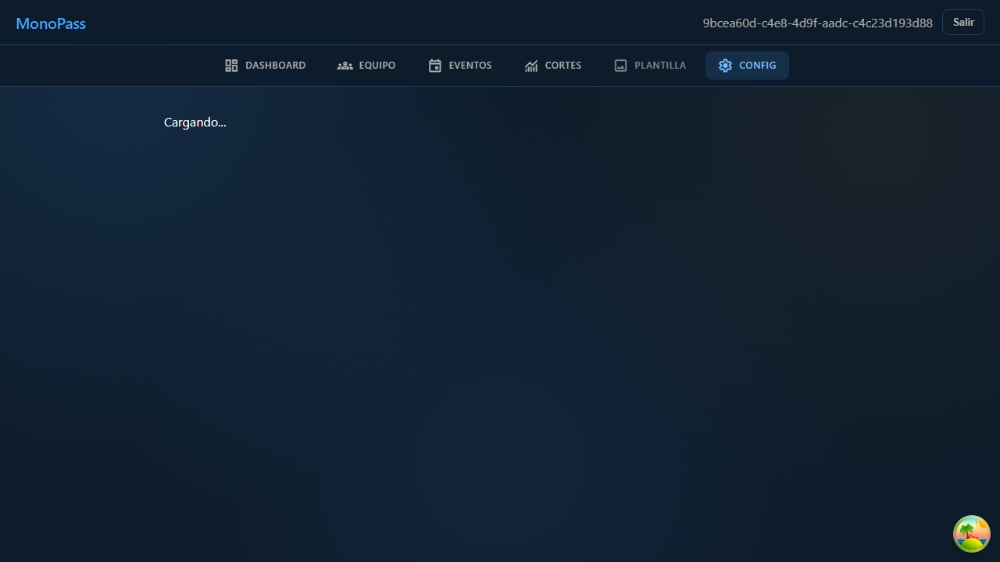

# Manual De Usuario Gerente (MVP)

## 1. Objetivo
Este manual describe la operacion del rol Gerente para:
- Supervisar dashboard operativo.
- Gestionar equipo (RPs y staff scanner).
- Administrar eventos y plantilla QR.
- Consultar cortes y ajustar configuraciones.

## 2. Prerrequisitos
- Usuario Gerente activo.
- Credenciales validas.
- Acceso a red y datos del entorno operativo.

## 3. Permisos Del Rol (Validados)
- Puede acceder a: `/manager`, `/manager/team/*`, `/manager/events`, `/manager/template`, `/manager/cuts`, `/manager/settings`.
- Puede administrar: clubs, eventos, RPs, grupos RP y staff scanner.
- No puede usar rutas de otros roles: `/rp/*`, `/scanner/*`.

## 4. Historias De Usuario Y Flujos

### HU-MGR-01: Revisar dashboard operativo
**Objetivo**
El gerente consulta KPIs clave antes de operar.

**Flujo**
1. Iniciar sesion con usuario Gerente.
2. El sistema redirige a `/manager`.
3. Revisar tarjetas KPI, actividad semanal y top RPs.

**Resultado esperado**
- Visualizacion de resumen operativo actualizado.
- Accesos rapidos a eventos, RPs y cortes.

**Screenshot**

---

### HU-MGR-02: Gestionar equipo de RPs
**Objetivo**
El gerente administra usuarios RP y su disponibilidad.

**Flujo**
1. Ir a `/manager/team/rps`.
2. Crear RP o editar estado (activar/desactivar).
3. Revisar asignaciones y limites por evento.

**Resultado esperado**
- RPs creados/actualizados correctamente.
- Estados reflejados en la lista del equipo.

**Screenshot**

---

### HU-MGR-03: Gestionar staff scanner
**Objetivo**
El gerente controla cuentas de escaneo en puerta.

**Flujo**
1. Ir a `/manager/team/staff`.
2. Crear scanner o cambiar estado activo/inactivo.
3. Revisar ultima actividad.

**Resultado esperado**
- Cuentas scanner administradas por gerente.
- Solo scanners activos pueden operar.

**Screenshot**

---

### HU-MGR-04: Gestionar grupos de RPs
**Objetivo**
El gerente organiza RPs en grupos operativos.

**Flujo**
1. Ir a `/manager/team/groups`.
2. Crear grupo o editar grupo existente.
3. Asociar RPs del equipo al grupo.

**Resultado esperado**
- Grupos creados y editables por el gerente.
- Solo se pueden asociar RPs del mismo manager.

**Screenshot**

---

### HU-MGR-05: Gestionar clubs
**Objetivo**
El gerente administra clubes para operar eventos.

**Flujo**
1. Ir a `/manager/team/clubs`.
2. Crear o editar club.
3. Activar o desactivar club.

**Resultado esperado**
- Clubs actualizados en el modulo de equipo.
- Clubs desactivados no deben habilitar operacion nueva.

**Screenshot**

---

### HU-MGR-06: Administrar eventos
**Objetivo**
El gerente crea y mantiene eventos con asignaciones.

**Flujo**
1. Ir a `/manager/events`.
2. Crear/duplicar evento o ajustar estado del evento.
3. Asignar RPs y limites por asignacion.

**Resultado esperado**
- Eventos visibles con estado y asignaciones.
- Cambios persistidos en el modulo.

**Screenshot**

---

### HU-MGR-07: Configurar plantilla y posicion QR
**Objetivo**
El gerente define imagen base y zona QR del ticket.

**Flujo**
1. Ir a `/manager/template`.
2. Seleccionar evento.
3. Ajustar imagen/posicion/tamano QR.
4. Guardar plantilla.

**Resultado esperado**
- Plantilla asociada al evento.
- Preview actualizado en tiempo real.

**Screenshot**

---

### HU-MGR-08: Consultar cortes
**Objetivo**
El gerente audita escaneos por evento y RP.

**Flujo**
1. Ir a `/manager/cuts`.
2. Filtrar por evento, RP y rango de fecha/hora.
3. Revisar totales y detalle por RP.

**Resultado esperado**
- Totales por tipo (General/VIP/Otro) consistentes con escaneos.
- Detalle disponible para auditoria.

**Screenshot**

---

### HU-MGR-09: Ajustar configuracion de etiqueta OTRO
**Objetivo**
El gerente personaliza la etiqueta del tipo `OTHER`.

**Flujo**
1. Ir a `/manager/settings`.
2. Editar campo `Etiqueta`.
3. Guardar configuracion.

**Resultado esperado**
- Etiqueta actualizada y disponible en modulos RP/Scanner.

**Screenshot**

## 5. Errores frecuentes
- `Invalid or missing token`: sesion expirada.
- `Solo managers pueden acceder a este recurso`: intento de acceso con rol incorrecto.
- `Seeding deshabilitado en este entorno`: endpoint de seed bloqueado por seguridad.
