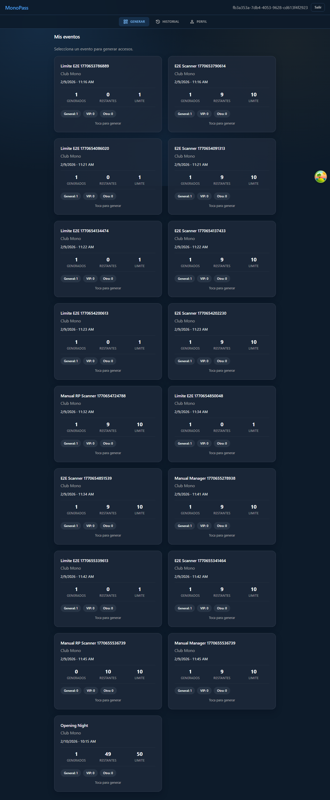
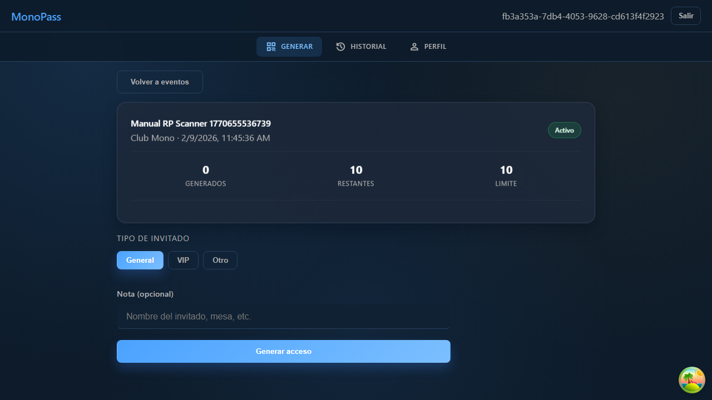
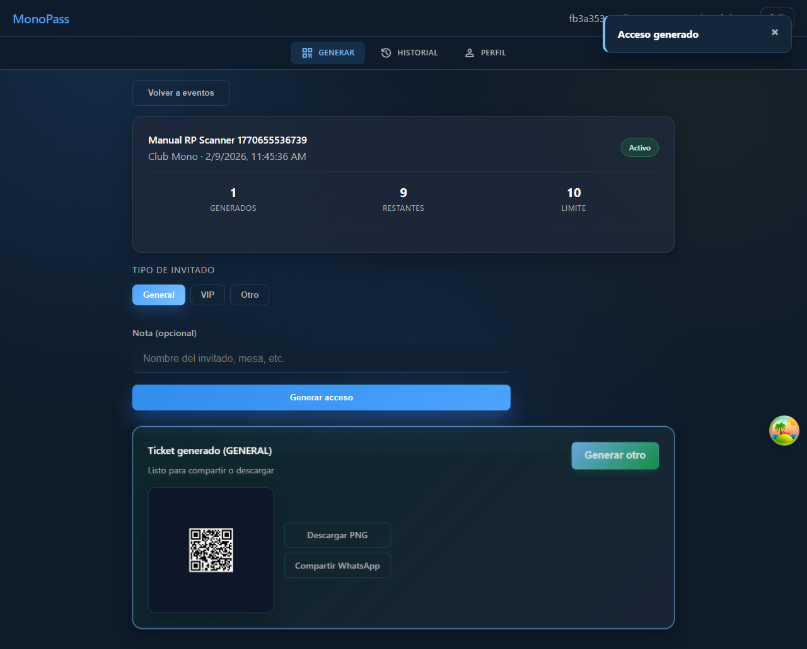
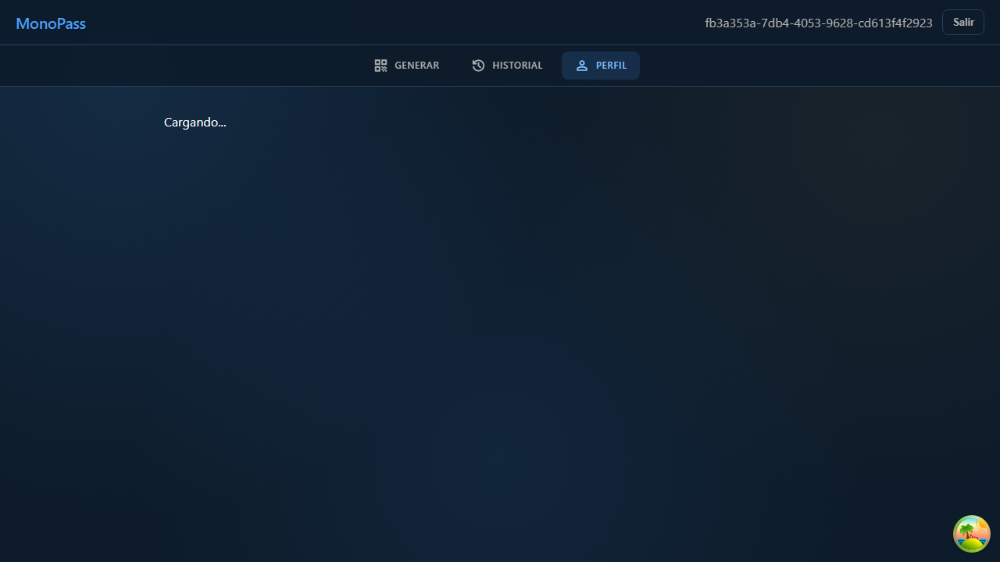

# Manual De Usuario RP (MVP)

## 1. Objetivo
Este manual describe el uso del portal RP para:
- Ver eventos asignados.
- Generar accesos QR.
- Consultar historial de accesos.

## 2. Prerrequisitos
- Usuario RP activo.
- Credenciales validas.
- Evento asignado por gerente.

## 3. Permisos Del Rol (Validados)
- Puede acceder a: `/rp`, `/rp/history`, `/rp/profile`.
- Puede operar: generar accesos, descargar/compartir ticket y consultar su historial.
- No puede acceder a rutas de gerente o scanner.

## 4. Historias De Usuario Y Flujos

### HU-RP-01: Ver eventos asignados
**Objetivo**
El RP identifica rapidamente los eventos donde puede operar.

**Flujo**
1. Iniciar sesion con usuario RP.
2. El sistema redirige a `/rp`.
3. Revisar tarjetas de eventos activos.

**Resultado esperado**
- Solo aparecen eventos asignados al RP.
- Se muestran consumos (generados/restantes/limite).

**Screenshot**

---

### HU-RP-02: Generar acceso para un evento
**Objetivo**
El RP genera un ticket QR para un invitado del evento.

**Flujo**
1. Seleccionar un evento en la lista.
2. Elegir tipo de invitado (`General`, `VIP`, `Otro`).
3. Opcional: agregar nota.
4. Presionar `Generar acceso`.

**Resultado esperado**
- Se crea un ticket nuevo.
- Se muestra preview del ticket.
- Se habilita descarga de PNG.

**Screenshots**

---

### HU-RP-03: Consultar historial de accesos
**Objetivo**
El RP consulta sus tickets y su estado.

**Flujo**
1. Abrir menu inferior.
2. Entrar a `Historial`.
3. Revisar lista y estado de tickets.

**Resultado esperado**
- Se ven tickets emitidos por el RP.
- Cada ticket muestra estado y metadatos relevantes.

**Screenshot**

---

### HU-RP-04: Consultar perfil del RP
**Objetivo**
El RP valida su identidad operativa y cierra sesion cuando termina turno.

**Flujo**
1. Abrir menu inferior.
2. Entrar a `Perfil`.
3. Revisar datos basicos y, si aplica, cerrar sesion.

**Resultado esperado**
- El RP visualiza su informacion principal.
- Puede cerrar sesion de forma segura.

**Screenshot**

## 5. Errores frecuentes
- `No se pudo iniciar sesion`: validar usuario/contrasena.
- `Limite de accesos alcanzado`: el gerente configuro limite y ya se consumio.
- Sin eventos visibles: no hay asignaciones activas para el RP.
