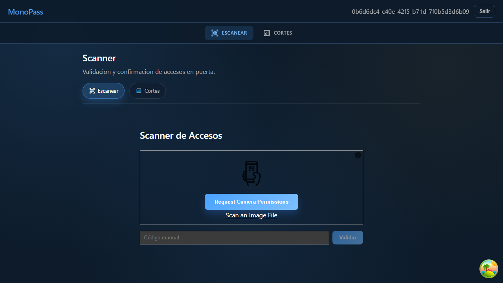
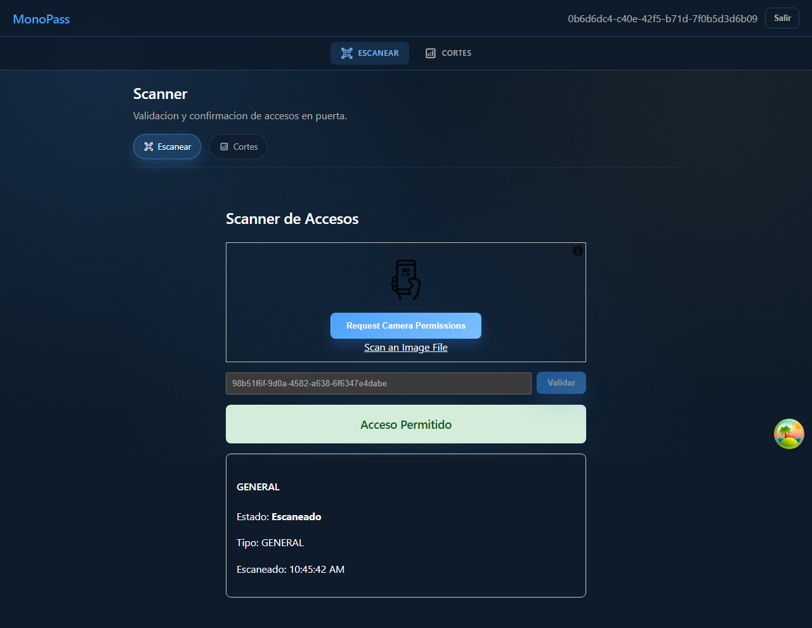
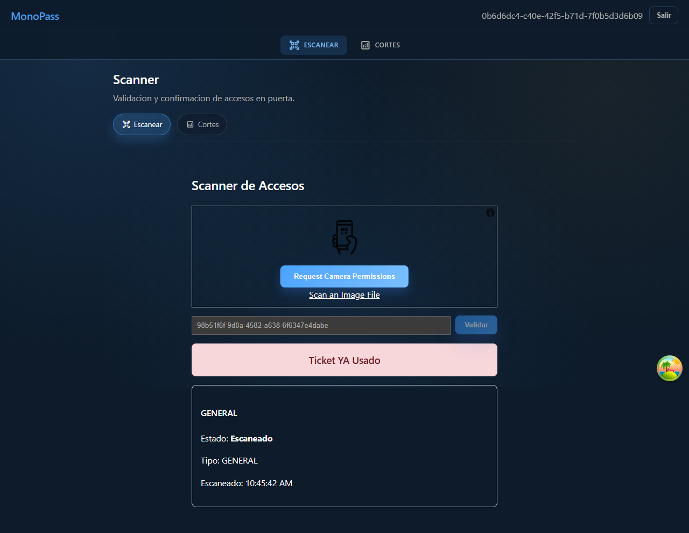
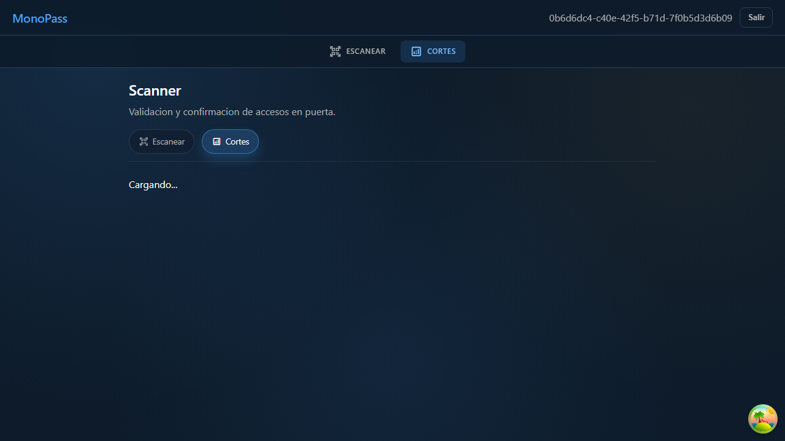

# Manual De Usuario Staff Scanner (MVP)

## 1. Objetivo
Este manual describe el uso del modulo Scanner para:
- Validar y confirmar accesos en puerta.
- Detectar tickets reutilizados.
- Consultar cortes operativos.

## 2. Prerrequisitos
- Usuario Scanner activo.
- Credenciales validas.
- Dispositivo con camara o captura manual de codigo.

## 3. Permisos Del Rol (Validados)
- Puede acceder a: `/scanner` y `/scanner/cuts`.
- Puede operar: validar y confirmar accesos, y consultar cortes de su alcance.
- No puede acceder a rutas de gerente ni RP.

## 4. Historias De Usuario Y Flujos

### HU-SCAN-01: Acceder a la pantalla de escaneo
**Objetivo**
El staff entra al modulo operativo de lectura de tickets.

**Flujo**
1. Iniciar sesion con usuario Scanner.
2. El sistema redirige a `/scanner`.
3. Verificar campo de captura manual y estado listo para validar.

**Resultado esperado**
- Pantalla lista para capturar token.
- Sin acceso a modulos administrativos.

**Screenshot**

---

### HU-SCAN-02: Validar y confirmar ticket valido
**Objetivo**
Permitir entrada de un ticket valido no usado.

**Flujo**
1. Ingresar token en campo manual (o leer QR con camara).
2. Presionar `Validar`.
3. El sistema valida y confirma entrada.

**Resultado esperado**
- Feedback de exito.
- Ticket en estado `Escaneado`.

**Screenshot**

---

### HU-SCAN-03: Bloquear ticket reutilizado
**Objetivo**
Evitar doble ingreso con el mismo ticket.

**Flujo**
1. Reintentar validar el mismo token ya confirmado.
2. Revisar respuesta del sistema.

**Resultado esperado**
- Respuesta de error (`Ticket YA Usado` o equivalente).
- No se permite nueva confirmacion.

**Screenshot**

---

### HU-SCAN-04: Consultar cortes del scanner
**Objetivo**
Revisar resumen de escaneos por evento/RP desde el rol scanner.

**Flujo**
1. Abrir `Cortes` en navegacion del scanner.
2. Aplicar filtros por evento/fecha si se requiere.
3. Revisar totales y detalle por RP.

**Resultado esperado**
- Se muestran totales de escaneo.
- El detalle refleja tickets confirmados reales.

**Screenshot**

## 5. Errores frecuentes
- `Invalid or missing token`: sesion expirada o ausente.
- `Scanner no autorizado o inactivo`: cuenta desactivada.
- `Ticket pertenece a otro manager`: token fuera de alcance del scanner.
