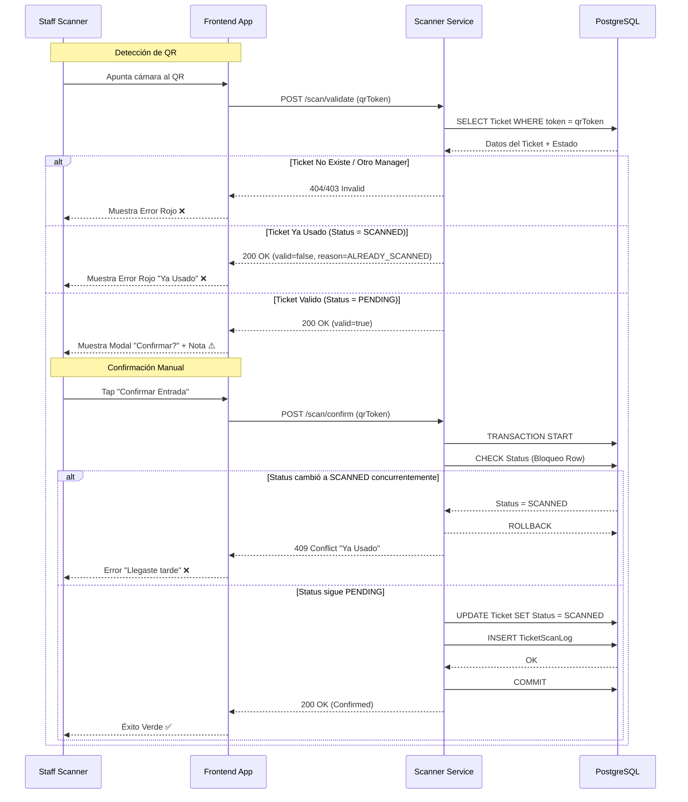

# Flujos Técnicos del Escáner

El proceso de escaneo es crítico para la operación. Este documento detalla el comportamiento esperado del microservicio de Scanner.

## Diagrama de Secuencia: Validación y Confirmación

## Reglas de Comportamiento

### 1. Atomicidad
La operación de confirmación es **atómica**. Utilizamos transacciones de base de datos para asegurar que dos scanners intentando leer el mismo código al mismo tiempo no permitan una doble entrada. Solo uno tendrá éxito, el otro recibirá un error `409 Conflict`.

### 2. Comportamiento Offline
Actualmente **MonoPass Club requiere conexión a internet** para validar.
- Si el dispositivo pierde conexión, la App mostrará un estado de "Reconectando...".
- No se permite validación offline en esta versión para garantizar la seguridad anti-fraude.

### 3. Latencia
- El servicio está optimizado para responder en `< 200ms`.
- Si la respuesta tarda más de `5s` (timeout), la App asumirá error de red y permitirá reintentar.
